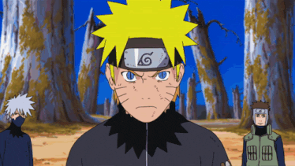
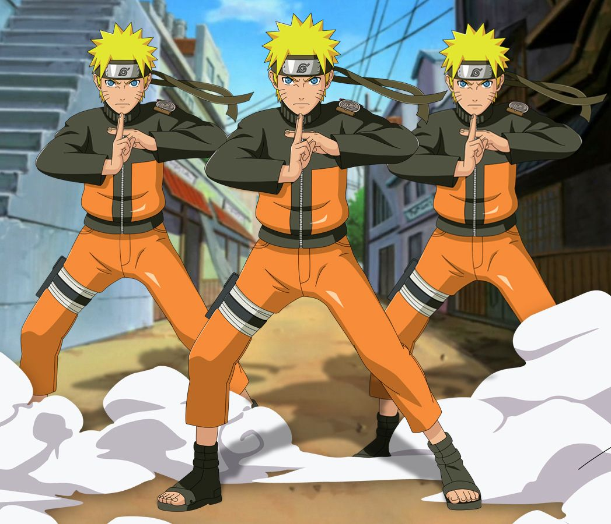
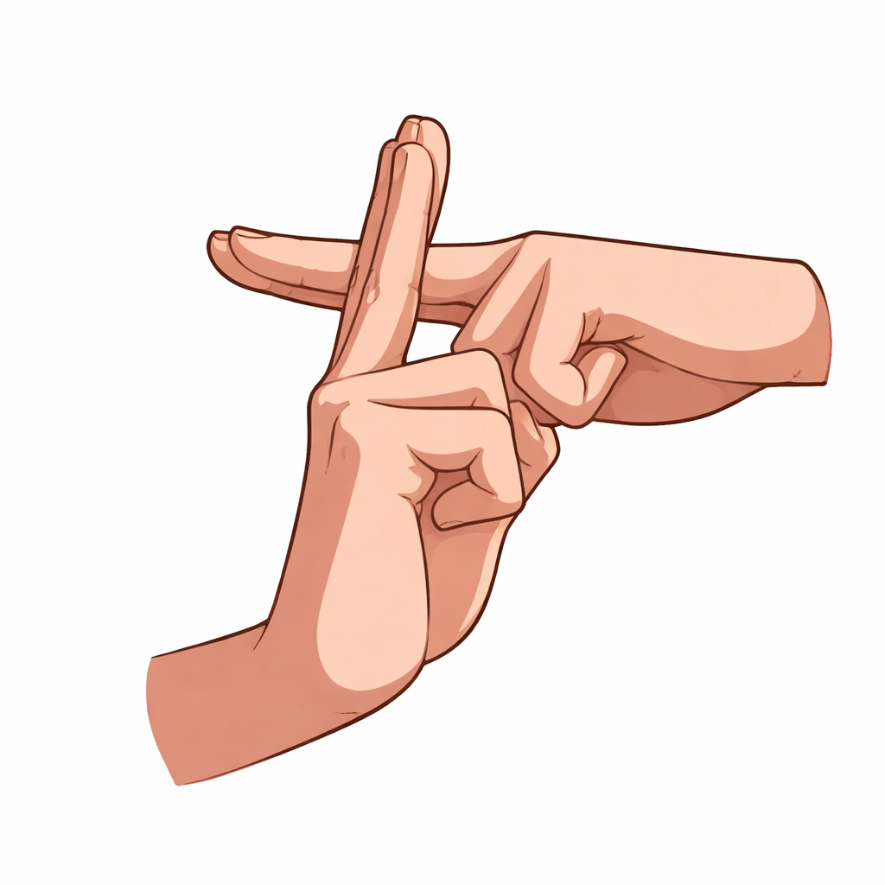

<p align="center">
  
</p>

<h1 align="center">🍥 Shadow Clone Jutsu — Real-Time Camera Effect</h1>

<p align="center">
  
  
  
  
</p>

<p align="center">
  <b>Perform the iconic Clone Seal on camera → summon a real-time army of yourself!</b><br/>
  <i>Powered by AI-driven person segmentation &amp; hand gesture recognition.</i>
</p>

---

## 🌀 What Is This?

A **real-time computer vision project** that brings the famous **Naruto Shadow Clone Jutsu** to life using your webcam! When you form the Clone Seal hand gesture, the system:

1. 🤚 **Detects** your hand seal using MediaPipe's AI hand landmark model
2. ✂️ **Segments** your body from the background using AI selfie segmentation
3. 👥 **Clones** your person-only cutout and places it beside you
4. 🌊 **Renders** you on top, so you always stand in front of your clones

<p align="center">
  
  <br/>
  <i>↑ The iconic Shadow Clone formation we're recreating in real-time!</i>
</p>

---

## ✋ The Clone Seal

<p align="center">
  
</p>

<p align="center">
  Form this <b>crossed-finger seal</b> with both hands in front of the camera.<br/>
  Hold it steady — clones appear <b>one by one</b> every ~0.5 seconds!
</p>

| Gesture Requirement | Description |
|:---:|:---|
| ☝️ **Index Fingers** | Both index fingers must be extended upward |
| ✊ **Other Fingers** | At least one other finger should be curled |
| 🤝 **Hands Close** | Both wrists must be near each other (interlocked) |

---

## 🚀 Quick Start

### 1. Clone the Repo

```bash
git clone https://github.com/harsh5d5/jutsu_.git
cd jutsu_
```

### 2. Install Dependencies

```bash
pip install opencv-python mediapipe numpy
```

### 3. Download AI Models

Place these two files **in the project root folder**:

| Model | Size | Download Link |
|:---|:---:|:---|
| `hand_landmarker.task` | ~7.5 MB | [⬇️ Download](https://storage.googleapis.com/mediapipe-models/hand_landmarker/hand_landmarker/float16/1/hand_landmarker.task) |
| `selfie_segmenter.tflite` | ~250 KB | [⬇️ Download](https://storage.googleapis.com/mediapipe-models/image_segmenter/selfie_segmenter/float16/latest/selfie_segmenter.tflite) |

### 4. Run the Jutsu!

```bash
python shadow_clone_jutsu.py
```

---

## 🎮 Controls

| Key | Action |
|:---:|:---|
| <kbd>Q</kbd> | Quit the application |
| <kbd>R</kbd> | Reset / dismiss all clones |
| 🤞 **Hold Seal** | Spawn clones one-by-one (up to 5) |

---

## 🧠 How It Works — Technical Deep Dive

```
┌──────────────┐    ┌──────────────────┐    ┌────────────────────┐
│  Webcam Feed │───▶│  MediaPipe Tasks │───▶│  Person Extraction │
│  (640×480)   │    │  • Hand Landmarks│    │  • Erode + Blur    │
│              │    │  • Selfie Segm.  │    │  • Background = 0  │
└──────────────┘    └──────────────────┘    └────────┬───────────┘
                                                     │
                    ┌──────────────────┐              ▼
                    │   Final Output   │◀──  ┌───────────────────┐
                    │  • Clones Behind │     │  Rendering Engine │
                    │  • User on Top   │     │  • Warp Affine    │
                    │  • Smoke Effects │     │  • Alpha Blend    │
                    └──────────────────┘     │  • Layered Comp.  │
                                             └───────────────────┘
```

### Core Pipeline

| Stage | Technology | Purpose |
|:---|:---|:---|
| **Hand Detection** | MediaPipe HandLandmarker | Detects 21 landmarks per hand to recognize the Clone Seal |
| **Segmentation** | MediaPipe SelfieSegmenter | Creates a per-pixel confidence mask separating you from the background |
| **Extraction** | OpenCV (Erode + GaussianBlur) | Cleans the mask to create crisp person-only cutouts with no background bleed |
| **Cloning** | OpenCV (WarpAffine) | Transforms the extracted person image to different positions and scales |
| **Compositing** | NumPy alpha blending | Layers clones behind you, then pastes you on top |
| **Effects** | OpenCV (addWeighted) | Smoke "poof" animation on each clone spawn |

---

## 📂 Project Structure

```
Naruto/
├── 📜 shadow_clone_jutsu.py      # Main application script
├── 🤖 hand_landmarker.task       # AI model — hand gesture detection
├── 🤖 selfie_segmenter.tflite    # AI model — person segmentation
├── 📖 README.md                  # You are here!
└── 🖼️ image/
    ├── a39c766...97.jpg           # Shadow Clone reference art
    ├── hand.png                   # Clone Seal gesture reference
    └── naruto-naruto-shippuden.gif # Animated Naruto GIF
```

---

## ⚡ Features

<table>
<tr>
<td width="50%">

### 🎯 Person-Only Clones
AI segmentation strips the background **before** cloning. No circles, no blurry ovals — just a clean cutout of your body.

### 🔄 Live Movement
Clones mirror your real-time movements. Wave your hand, tilt your head — they all follow!

### 🎨 Shadow Tint
Subtle blue-shift on clones makes them look like authentic shadow clones from the anime.

</td>
<td width="50%">

### 📊 Sequential Spawning
Clones appear **one by one** while you hold the seal, with a satisfying 0.55s interval between each.

### 💨 Smoke Effects
White expanding "poof" animation on each spawn — just like the anime!

### 🧑‍🤝‍🧑 Layered Rendering
You **always** stay in front. Clones are rendered behind you in depth-sorted order.

</td>
</tr>
</table>

---

## 🎯 Clone Positions

The 5 clones spawn in this formation:

```
         ┌───┐
         │ 5 │           ← Center Back (scale 0.83)
         └───┘
    ┌───┐     ┌───┐
    │ 3 │     │ 4 │      ← Far Sides (scale 0.90)
    └───┘     └───┘
   ┌───┐  ┌───┐  ┌───┐
   │ 1 │  │YOU│  │ 2 │   ← Near Sides (scale 0.97)
   └───┘  └───┘  └───┘
```

---

## 🛠️ Requirements

| Requirement | Minimum |
|:---|:---|
| **Python** | 3.10+ |
| **OpenCV** | 4.x (`opencv-python`) |
| **MediaPipe** | 0.10.x+ |
| **NumPy** | 1.21+ |
| **Webcam** | Any USB/built-in camera |
| **OS** | Windows / macOS / Linux |

---

## 🐛 Troubleshooting

| Issue | Solution |
|:---|:---|
| `❌ Missing model files` | Download both `.task` and `.tflite` files (links above) and place them in the project root |
| Camera not opening | Try changing `cv2.VideoCapture(0)` to `cv2.VideoCapture(1)` |
| Low FPS / laggy | Resolution is already set to 640×480 for performance. Close other camera apps. |
| Seal not detected | Ensure both hands are clearly visible. Good lighting helps! |
| Clones look weird | Make sure you have good contrast against your background |

---

## 🙏 Credits & Acknowledgments

- **[MediaPipe](https://mediapipe.dev/)** — Google's amazing ML framework for hand & body detection
- **[OpenCV](https://opencv.org/)** — The backbone of real-time computer vision
- **[Naruto (Masashi Kishimoto)](https://en.wikipedia.org/wiki/Naruto)** — For the legendary Shadow Clone Jutsu that inspired this project

---

<p align="center">
  
  <br/><br/>
  <b>🍥 "Kage Bunshin no Jutsu!" 🍥</b><br/>
  <i>Made with ❤️ and chakra by <a href="https://github.com/harsh5d5">harsh5d5</a></i>
</p>

---

<p align="center">
  
</p>
